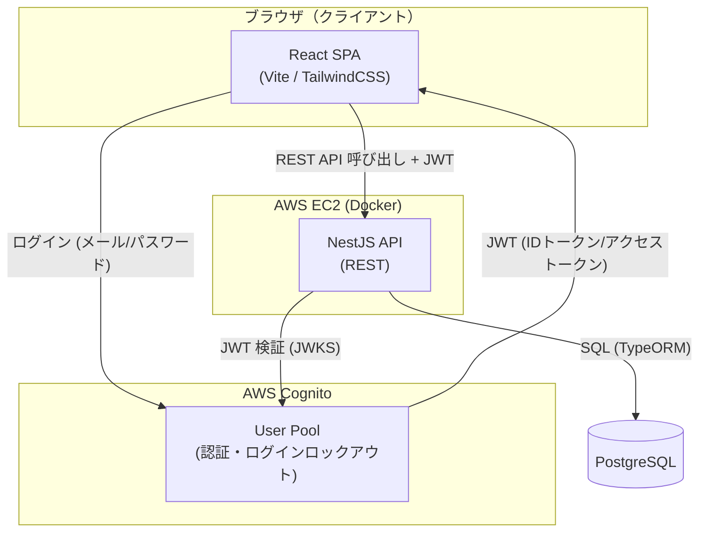
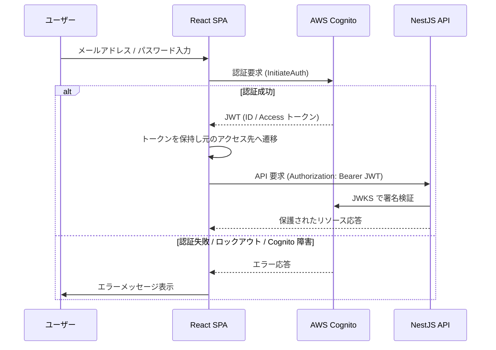
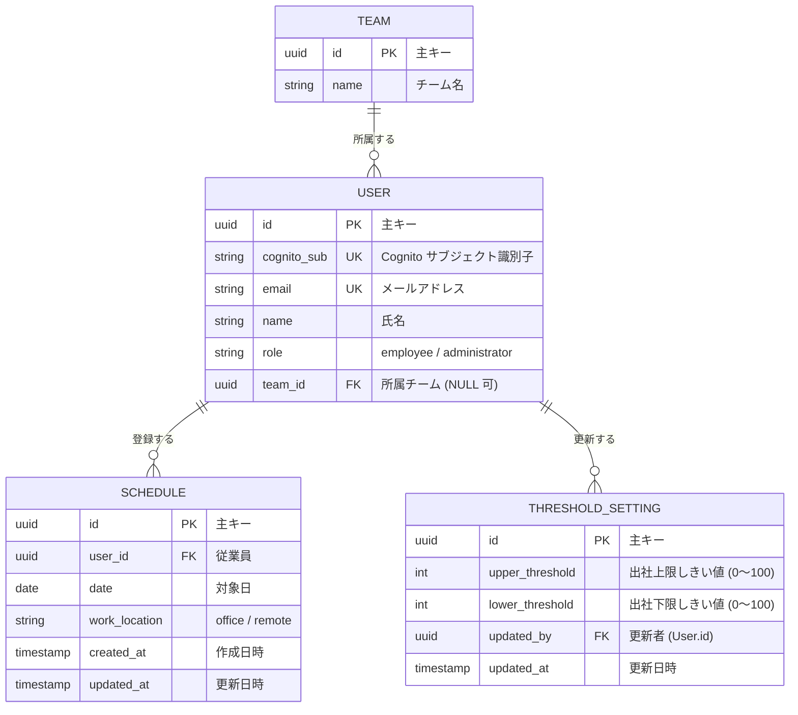

# Design Document

AI Team Planner 設計書

## Overview

AI Team Planner は、従業員が翌週（Target_Week）の勤務予定（出社／在宅）を登録し、チーム全体の勤務状況をカレンダー形式で確認できる Web システムである。管理者は全体の勤務状況をダッシュボードで把握し、AI 分析機能により出社人員の過不足に関する警告や勤務パターンの要約を受け取ることができる。

本設計書は、承認済みの要件定義書（`requirements.md`）に基づいて、システムのアーキテクチャ、コンポーネント構成、データモデル、API 仕様、フォルダ構造、エラーハンドリング、テスト戦略、および property-based testing のための Correctness Properties を定義する。

### 技術スタック

| 区分 | 技術 |
| --- | --- |
| Frontend | React、TypeScript、Vite、TailwindCSS |
| Backend | NestJS、TypeScript |
| Database | PostgreSQL |
| 認証 | AWS Cognito |
| インフラ | Docker、AWS EC2 |

### 設計上の主要な決定と根拠

- **認証は AWS Cognito に委譲する**: 認証・パスワード管理・ログインロックアウトなどのセキュリティ機能を自前実装せず、Cognito の User Pool 機能を利用する。バックエンドは Cognito が発行した JWT を検証するだけにとどめ、責務を分離する（要件 1）。
- **勤務予定は「ユーザー×日付」で一意」**: 同一 Employee が同一日に複数の勤務区分を保持しないよう、データベースの一意制約と upsert 処理で保証する（要件 2.7）。これにより登録／更新の区別をアプリケーションロジックから排除し、整合性を DB レベルで担保する。
- **勤務区分は列挙型（enum）で制約**: `office` / `remote` の 2 値のみを許容し、DB・DTO・ドメイン層の各レイヤーで検証する（要件 2.2、2.3）。
- **しきい値設定は単一レコードで管理**: システム全体で 1 組の Upper_Threshold / Lower_Threshold を保持する。管理者による更新のたびに値と更新者・更新日時を記録する（要件 4.3、4.4）。
- **AI 分析は集計ロジックとメッセージ生成を分離**: 出社人員数の集計・しきい値判定という決定的な純粋ロジックと、要約メッセージ生成を明確に分離することで、テスト容易性を高める（要件 5）。

## Architecture

本システムは、React による SPA フロントエンド、NestJS による REST API バックエンド、PostgreSQL データベース、および認証基盤としての AWS Cognito から構成される。フロントエンドとバックエンドは Docker コンテナとして AWS EC2 上で稼働する。



### 認証フロー



### レイヤー構成

- **Frontend（React SPA）**: 画面表示・ユーザー操作・入力検証（一次）・API 呼び出し・認証トークン管理を担う。保護されたルートは認証ガードで制御し、未認証時はログイン画面へリダイレクトする（要件 1.1、1.6）。
- **Backend（NestJS API）**: REST API を提供する。JWT 検証ガード、ロールベースアクセス制御、勤務予定の CRUD、集計、しきい値管理、AI 分析を担う。ビジネスロジックの一次検証はここで強制する。
- **Database（PostgreSQL）**: ユーザー・チーム・勤務予定・しきい値設定を永続化する。一意制約により勤務予定の整合性を保証する。
- **AWS Cognito**: 認証、パスワード管理、連続ログイン失敗によるアカウントロックアウト（要件 1.4）を担う。

## Components and Interfaces

### Backend コンポーネント（NestJS モジュール）

| モジュール | 責務 | 対応要件 |
| --- | --- | --- |
| AuthModule | Cognito JWT の検証ガード（`JwtAuthGuard`）、ロールベースガード（`RolesGuard`）、ログアウト時のトークン無効化連携 | 1.1〜1.7 |
| UsersModule | 従業員情報の照会、`cognito_sub` とアプリユーザーの紐付け、所属チームの解決 | 1、3.4 |
| TeamsModule | チーム情報の照会、チーム別メンバー取得 | 3.3、3.4 |
| ScheduleModule | 勤務予定の登録・更新（upsert）・照会、Target_Week 範囲検証、勤務区分検証 | 2.1〜2.7、3 |
| CalendarModule | チーム単位の週次勤務予定の集約、Occupancy_Count の算出 | 3.1〜3.7 |
| DashboardModule | 全体 Occupancy_Count・出社率／在宅率の算出、出社者一覧、しきい値設定の取得・更新 | 4.1〜4.7 |
| AnalysisModule | Occupancy_Count のしきい値評価、警告メッセージ生成、勤務パターン要約生成 | 5.1〜5.7 |

### 主要なドメインサービス（純粋ロジック）

テスト容易性のため、副作用（DB・外部 API）を持たない純粋関数として以下を切り出す。

- `TargetWeekResolver`: 基準日から Target_Week（翌週の月曜〜日曜、7 日間）を導出し、任意の日付が範囲内かを判定する（要件 2.1、2.5）。
- `WorkLocationValidator`: 入力値が `office` / `remote` のいずれかであることを検証する（要件 2.2、2.3）。
- `OccupancyCalculator`: 勤務予定集合から日別 Occupancy_Count、出社率・在宅率を算出する（要件 3.2、4.1、4.5）。
- `ThresholdValidator`: しきい値の妥当性（0〜100 の整数、Upper > Lower）を検証する（要件 4.3、4.4）。
- `AnalysisEvaluator`: 日別 Occupancy_Count としきい値から過多／過少警告と勤務パターン要約を生成する（要件 5.2〜5.4）。

### Frontend コンポーネント（React）

| コンポーネント | 責務 | 対応要件 |
| --- | --- | --- |
| `AuthProvider` / `ProtectedRoute` | 認証状態管理、未認証／トークン失効時のログイン画面リダイレクト（元アクセス先を保持） | 1.1、1.6 |
| `LoginPage` | ログインフォーム、認証エラー・ロックアウト・障害メッセージ表示 | 1.2〜1.5 |
| `ScheduleEditor` | 翌週勤務予定の登録・更新フォーム、勤務区分選択、対象範囲外・不正値の抑止 | 2.1〜2.6 |
| `TeamCalendar` | チーム週次カレンダー表示、Occupancy_Count 表示、チーム選択、未登録表示、取得エラー表示 | 3.1〜3.7 |
| `AdminDashboard` | Occupancy_Count・出社率／在宅率表示、日別出社者一覧、しきい値設定フォーム | 4.1〜4.7 |
| `AnalysisPanel` | AI 分析の実行・警告メッセージ・パターン要約表示 | 5.1、5.5、5.6 |

## Data Models

以下は TypeScript / TypeORM のエンティティ表現の概念モデルである。実際の DB スキーマは後述の ERD に対応する。

```typescript
// 勤務区分（enum）
export enum WorkLocation {
  Office = 'office',
  Remote = 'remote',
}

// ロール（enum）
export enum UserRole {
  Employee = 'employee',
  Administrator = 'administrator',
}

// 従業員 / ユーザー
export interface User {
  id: string;            // UUID (主キー)
  cognitoSub: string;    // Cognito のサブジェクト識別子 (一意)
  email: string;         // メールアドレス (一意)
  name: string;          // 氏名
  role: UserRole;        // employee / administrator
  teamId: string | null; // 所属チーム (Team.id への外部キー)
}

// チーム
export interface Team {
  id: string;   // UUID (主キー)
  name: string; // チーム名
}

// 勤務予定 (ユーザー×日付で一意)
export interface Schedule {
  id: string;                 // UUID (主キー)
  userId: string;             // User.id への外部キー
  date: string;               // 対象日 (YYYY-MM-DD)
  workLocation: WorkLocation; // office / remote
  createdAt: Date;
  updatedAt: Date;
}

// しきい値設定 (システム全体で単一レコード)
export interface ThresholdSetting {
  id: string;            // UUID (主キー)
  upperThreshold: number; // 出社上限しきい値 (0〜100)
  lowerThreshold: number; // 出社下限しきい値 (0〜100)
  updatedBy: string;      // 更新した Administrator の User.id
  updatedAt: Date;
}

// AI 分析結果 (返却用の値オブジェクト。永続化は任意)
export interface AnalysisResult {
  targetWeekStart: string;        // Target_Week の起点日 (月曜, YYYY-MM-DD)
  warnings: AnalysisWarning[];    // 過多／過少警告
  summary: DailyPatternSummary[]; // 日別の出社／在宅人数要約
  generatedAt: Date;
}

export interface AnalysisWarning {
  date: string;                          // 対象日 (YYYY-MM-DD)
  type: 'over_capacity' | 'under_capacity'; // 過多 / 過少
  occupancyCount: number;                // 該当日の出社人員数
  message: string;                       // 警告メッセージ (日本語)
}

export interface DailyPatternSummary {
  date: string;        // 対象日 (YYYY-MM-DD)
  officeCount: number; // 出社人数
  remoteCount: number; // 在宅人数
}
```

### AnalysisResult の永続化方針

AI 分析結果（`AnalysisResult`）は、Target_Week の勤務予定としきい値設定から常に再計算可能な導出データである。そのため本設計では **永続化を必須としない**（要求のたびに再計算する）。監査履歴が必要になった場合に限り、`analysis_results` テーブルを追加して JSON カラムに保存する拡張余地を残す。この判断により、勤務予定の更新と分析結果の不整合を防ぐ。

## ERD（エンティティ関連図）



### 一意制約・インデックス

- `USER.cognito_sub`: 一意制約（Cognito ユーザーとの 1:1 紐付け）。
- `USER.email`: 一意制約。
- `SCHEDULE (user_id, date)`: **複合一意制約**（要件 2.7。1 ユーザー 1 日 1 件を保証し、upsert の衝突キーとして使用）。
- `SCHEDULE (date)`: インデックス（日別 Occupancy_Count 集計の高速化）。

## API一覧（API エンドポイント一覧）

すべての保護エンドポイントは `Authorization: Bearer <JWT>` を要求する。認証ガード（`JwtAuthGuard`）で JWT を検証し、`RolesGuard` でロールを判定する。

| メソッド | パス | 説明 | 認証 / ロール |
| --- | --- | --- | --- |
| POST | `/auth/login` | メールアドレス／パスワードで Cognito 認証を行い JWT を返す。失敗・ロックアウト・障害時はエラーを返す | 不要 |
| POST | `/auth/logout` | 認証トークンを無効化する | 要認証（全ロール） |
| GET | `/auth/me` | ログイン中ユーザーのプロフィール（ロール・所属チーム含む）を返す | 要認証（全ロール） |
| GET | `/schedules/me?weekStart=YYYY-MM-DD` | 自身の Target_Week の勤務予定（各日の勤務区分または未登録）を返す | 要認証（Employee） |
| PUT | `/schedules/me` | 自身の特定日の勤務予定を登録／更新（upsert）する。対象範囲外・不正値は拒否 | 要認証（Employee） |
| GET | `/teams` | チーム一覧を返す（カレンダーのチーム選択用） | 要認証（全ロール） |
| GET | `/calendar?teamId={id}&weekStart=YYYY-MM-DD` | 指定チーム（未指定時は自チーム）の週次勤務予定と日別 Occupancy_Count を返す | 要認証（全ロール） |
| GET | `/dashboard/occupancy?weekStart=YYYY-MM-DD` | Target_Week の日別 Occupancy_Count・出社率・在宅率を返す | 要認証（Administrator） |
| GET | `/dashboard/attendees?date=YYYY-MM-DD` | 指定日に出社を登録した Employee 一覧を返す | 要認証（Administrator） |
| GET | `/dashboard/threshold` | 現在の Upper/Lower しきい値設定を返す | 要認証（Administrator） |
| PUT | `/dashboard/threshold` | しきい値を設定する（0〜100 かつ Upper > Lower を検証。不正時は拒否） | 要認証（Administrator） |
| POST | `/analysis/run?weekStart=YYYY-MM-DD` | AI 分析を実行し、警告メッセージと勤務パターン要約を返す | 要認証（Administrator） |

### 主要な DTO（リクエスト／レスポンス例）

```typescript
// PUT /schedules/me リクエスト
interface UpsertScheduleRequest {
  date: string;               // YYYY-MM-DD (Target_Week 内)
  workLocation: WorkLocation; // office / remote
}

// GET /calendar レスポンス
interface CalendarResponse {
  weekStart: string;   // 起点日 (月曜)
  teamId: string;
  members: {
    userId: string;
    name: string;
    days: { date: string; workLocation: WorkLocation | null }[]; // null = 未登録
  }[];
  occupancyByDate: { date: string; officeCount: number }[];
}

// PUT /dashboard/threshold リクエスト
interface UpdateThresholdRequest {
  upperThreshold: number; // 0〜100
  lowerThreshold: number; // 0〜100 (upper > lower)
}
```

## フォルダ構造（ディレクトリ構成）

モノレポ構成とし、`frontend` と `backend` を分離する。インフラ関連は `infra` にまとめる。

```text
teamApp/
├── docker-compose.yml            # frontend / backend / postgres のローカル統合
├── README.md
├── frontend/                     # React + Vite + TypeScript + TailwindCSS
│   ├── Dockerfile
│   ├── index.html
│   ├── vite.config.ts
│   ├── tailwind.config.js
│   ├── tsconfig.json
│   ├── package.json
│   └── src/
│       ├── main.tsx              # エントリポイント
│       ├── App.tsx               # ルーティング定義
│       ├── api/                  # API クライアント (fetch ラッパー・型定義)
│       │   ├── client.ts
│       │   ├── schedules.ts
│       │   ├── calendar.ts
│       │   ├── dashboard.ts
│       │   └── analysis.ts
│       ├── auth/                 # 認証 (Cognito 連携・ガード)
│       │   ├── AuthProvider.tsx
│       │   ├── ProtectedRoute.tsx
│       │   └── cognito.ts
│       ├── components/           # 共通 UI コンポーネント
│       ├── features/             # 画面単位の機能
│       │   ├── login/            # LoginPage
│       │   ├── schedule/         # ScheduleEditor
│       │   ├── calendar/         # TeamCalendar
│       │   ├── dashboard/        # AdminDashboard
│       │   └── analysis/         # AnalysisPanel
│       ├── hooks/                # カスタムフック
│       ├── lib/                  # 純粋ユーティリティ (日付・週計算など)
│       └── types/                # 共有型定義
├── backend/                      # NestJS + TypeScript
│   ├── Dockerfile
│   ├── nest-cli.json
│   ├── tsconfig.json
│   ├── package.json
│   └── src/
│       ├── main.ts               # ブートストラップ
│       ├── app.module.ts         # ルートモジュール
│       ├── common/               # ガード・フィルタ・デコレータ・例外
│       │   ├── guards/           # JwtAuthGuard / RolesGuard
│       │   ├── filters/          # 例外フィルタ (統一エラー応答)
│       │   └── decorators/       # @Roles() など
│       ├── auth/                 # AuthModule (Cognito 連携)
│       ├── users/                # UsersModule
│       ├── teams/                # TeamsModule
│       ├── schedule/             # ScheduleModule
│       ├── calendar/             # CalendarModule
│       ├── dashboard/            # DashboardModule (しきい値含む)
│       ├── analysis/             # AnalysisModule
│       ├── domain/               # 純粋ドメインロジック (副作用なし)
│       │   ├── target-week.ts    # TargetWeekResolver
│       │   ├── work-location.ts  # WorkLocationValidator
│       │   ├── occupancy.ts      # OccupancyCalculator
│       │   ├── threshold.ts      # ThresholdValidator
│       │   └── analysis-eval.ts  # AnalysisEvaluator
│       ├── entities/             # TypeORM エンティティ
│       └── migrations/           # DB マイグレーション
├── infra/                        # AWS / デプロイ関連
│   └── ec2/                      # EC2 プロビジョニング・デプロイ手順
└── .kiro/                        # spec ドキュメント
```

## Correctness Properties

*プロパティとは、システムのすべての有効な実行に対して常に成り立つべき特性や振る舞いのことであり、システムが何をすべきかについての形式的な記述である。プロパティは、人間が読む仕様と機械が検証可能な正当性保証との橋渡しとなる。*

以下のプロパティは、受入基準のうち property-based testing に適した項目（自コードの純粋ロジックで、入力バリエーションが本質的に意味を持つもの）を、prework の分析と冗長性排除を経て導出したものである。認証（要件 1 の Cognito 依存部分）、パフォーマンス要件（3 秒／30 秒以内）、UI 遷移・障害時表示は property-based testing の対象外とし、統合テスト・例示テスト・エッジケーステストで扱う（Testing Strategy 参照）。

### Property 1: 勤務予定登録の round-trip

*For any* Employee、Target_Week 内の任意の日付、および任意の有効な Work_Location（office / remote）について、勤務予定を登録した直後に同一 Employee・同一日付の勤務予定を照会すると、登録した Work_Location と同一の値が返る。

**Validates: Requirements 2.1**

### Property 2: 勤務区分は 2 値のみを受理する

*For any* 文字列入力について、`WorkLocationValidator` は `office` または `remote` のいずれかであれば受理し、それ以外の値であれば必ず拒否する。保存される勤務予定の Work_Location は常に `office` または `remote` のいずれかである。

**Validates: Requirements 2.2, 2.3**

### Property 3: upsert による単一性（同一ユーザー・同一日は常に 1 件かつ最新値）

*For any* Employee、Target_Week 内の任意の日付、および同一日付に対する任意の登録操作列について、操作列の適用後に保持される当該 (user, date) の勤務予定は常に高々 1 件であり、その値は最後に登録された Work_Location と一致する。

**Validates: Requirements 2.4, 2.7**

### Property 4: Target_Week 範囲外の登録は拒否され状態は不変

*For any* 基準日と、その Target_Week（翌週の月曜〜日曜）の範囲外にある任意の日付について、当該日付への勤務予定登録は必ず拒否され、既存の勤務予定集合は一切変更されない。

**Validates: Requirements 2.5**

### Property 5: 照会・集約結果は Target_Week の 7 日分を網羅し未登録日を区別する

*For any* Employee と任意の登録状態について、勤務予定の照会（自身の照会およびカレンダー集約）は Target_Week の 7 日分すべてを返し、各日は「登録済みの Work_Location」または「未登録を示す印」のいずれか一方で表現される（登録がない日は必ず未登録印となる）。

**Validates: Requirements 2.6, 3.6**

### Property 6: Occupancy_Count は当日 office 登録者数に一致する

*For any* メンバー集合と任意の勤務予定集合、および任意の日付について、`OccupancyCalculator` が算出する当該日の Occupancy_Count は、その日に Work_Location = office を登録したメンバーの人数と正確に一致する。

**Validates: Requirements 3.2, 4.1**

### Property 7: チームフィルタは所属メンバーのみを返す

*For any* 複数チーム・メンバーを含む任意のデータと、任意に選択したチームについて、カレンダー集約結果に含まれるメンバーはすべて選択されたチームに所属しており、他チームのメンバーを一切含まない。

**Validates: Requirements 3.3**

### Property 8: 出社率・在宅率は 0〜100% に収まり合計が 100% になる

*For any* 任意の勤務予定集合と任意の日付について、算出される出社率および在宅率はいずれも 0% 以上 100% 以下であり、かつ当該日に勤務予定を登録したメンバーが 1 人以上存在する場合、出社率と在宅率の合計は 100% に等しい。

**Validates: Requirements 4.5**

### Property 9: 出社者一覧は当日 office 登録者と整合する

*For any* 任意の勤務予定集合と任意の日付について、`/dashboard/attendees` が返す出社者一覧の各要素は当該日に Work_Location = office を登録した Employee であり、一覧の件数は当該日の Occupancy_Count と一致する。

**Validates: Requirements 4.6**

### Property 10: しきい値は妥当な場合のみ受理され不正時は既存値を保持する

*For any* 整数ペア (upper, lower) について、`ThresholdValidator` は「0 ≤ lower ≤ 100 かつ 0 ≤ upper ≤ 100 かつ upper > lower」を満たす場合にのみ受理して保存し、それ以外の場合は必ず拒否して既存のしきい値設定を変更しない。

**Validates: Requirements 4.3, 4.4**

### Property 11: 警告は判定条件を満たす日にのみ生成され日付と人数を含む

*For any* 日別 Occupancy_Count の集合と任意のしきい値設定について、`AnalysisEvaluator` が生成する各警告は、過多警告であれば当該日の Occupancy_Count が Upper_Threshold 以上、過少警告であれば Lower_Threshold 以下という条件を満たす日にのみ対応し、かつ各警告メッセージには対象日付と当該 Occupancy_Count が含まれる。逆に、いずれの条件も満たさない日には警告が生成されない。

**Validates: Requirements 5.2, 5.3**

### Property 12: パターン要約は各日の実データと整合する

*For any* 任意の勤務予定集合について、`AnalysisEvaluator` が生成する勤務パターン要約は Target_Week の 7 日分すべてを含み、各日の officeCount と remoteCount はそれぞれ当該日に office / remote を登録したメンバーの実人数と一致する。

**Validates: Requirements 5.4**

## Error Handling

### 統一エラー応答

バックエンドは NestJS の例外フィルタ（`common/filters`）で例外を捕捉し、統一形式の JSON エラー応答を返す。フロントエンドはこの形式を解釈してユーザー向け日本語メッセージを表示する。

```typescript
interface ErrorResponse {
  statusCode: number; // HTTP ステータスコード
  errorCode: string;  // アプリ固有のエラーコード (例: SCHEDULE_OUT_OF_RANGE)
  message: string;    // ユーザー向け日本語メッセージ
}
```

### 分類別のハンドリング方針

| 分類 | 発生条件 | HTTP | 挙動 | 対応要件 |
| --- | --- | --- | --- | --- |
| 認証エラー | 資格情報不一致・未登録 | 401 | トークン非発行、認証失敗メッセージ | 1.3 |
| ロックアウト | 連続5回失敗（Cognito 判定） | 423 | 15分ロック、ロック通知メッセージ | 1.4 |
| 認証基盤障害 | Cognito 無応答・システムエラー | 503 | トークン非発行、一時的に認証不可メッセージ | 1.5 |
| 未認証／トークン失効 | JWT 欠如・検証失敗・期限切れ | 401 | フロントは元アクセス先を保持しログイン画面へリダイレクト | 1.1, 1.6 |
| 認可エラー | 非 Administrator が管理者機能へアクセス | 403 | アクセス拒否、権限不足メッセージ | 4.2 |
| 勤務区分バリデーション | office/remote 以外 | 400 | 登録拒否、許容値提示、既存不変 | 2.3 |
| 対象範囲バリデーション | Target_Week 範囲外の日付 | 400 | 登録拒否、許容範囲提示、既存不変 | 2.5 |
| しきい値バリデーション | 範囲外 or upper ≤ lower | 400 | 保存拒否、不正通知、変更前値保持 | 4.4 |
| データ取得失敗 | カレンダーデータ取得エラー | 5xx | フロントはエラーメッセージ表示、既存表示を変更しない | 3.7 |
| 分析対象なし | 対象週の勤務予定が 0 件 | 200 | 対象なしメッセージ、警告・要約は非生成 | 5.6 |
| 分析処理失敗 | AI 分析処理エラー | 5xx | 分析失敗メッセージ、勤務予定データは不変 | 5.7 |

### 冪等性・整合性の保証

- 勤務予定の登録／更新は `INSERT ... ON CONFLICT (user_id, date) DO UPDATE`（upsert）で実装し、複合一意制約により重複を DB レベルで防止する（要件 2.7）。
- バリデーションエラー時はトランザクションをコミットせず、既存データを変更しない（要件 2.3、2.5、4.4）。

## Testing Strategy

本機能は純粋ロジック（Target_Week 導出・勤務区分検証・Occupancy_Count 集計・率計算・しきい値検証・分析評価・upsert 単一性）を多く含むため、**property-based testing（PBT）が適切**である。一方で、認証（Cognito 依存）、認可ガード、パフォーマンス要件、UI 遷移・障害時表示は PBT に適さないため、統合テスト・例示的な単体テスト・エッジケーステストで補完する。両者は相補的であり、両方を必要とする。

### 二層テストアプローチ

- **Property テスト**: 上記 Correctness Properties（Property 1〜12）を、すべての入力に対して成り立つ普遍的性質として検証する。純粋ドメインロジック（`backend/src/domain/`）を対象とし、DB や Cognito はモック化する。
- **単体テスト（例示）**: 具体的な正常系の例、コンポーネント間の連携点、エッジケース・エラー条件を検証する。
- **統合テスト**: Cognito 認証・認可ガード・DB を含む end-to-end の代表シナリオを 1〜3 例で検証する。
- **スモークテスト**: Cognito のロックアウト設定など、一度限りの構成確認を単一実行で検証する。

### PBT の設定・実装方針

- ライブラリは TypeScript 向けの **fast-check** を用いる（スクラッチ実装しない）。
- 各 property テストは **最低 100 回のイテレーション**で実行する（`fc.assert(fc.property(...), { numRuns: 100 })`）。
- 各 property テストには設計書のプロパティを参照するコメントを付与する。
  - タグ形式: `// Feature: ai-team-planner, Property {番号}: {プロパティ本文}`
- 各 Correctness Property は **1 つの property テスト**で実装する。
- ジェネレータは、勤務区分の不正値（Property 2）、空の勤務予定集合（要件 3.5、4.7、5.6 のエッジケース）、Target_Week 範囲外日付（Property 4）、出社者 0 人の日、しきい値の境界値（0・100・upper=lower）などの境界条件を生成対象に含める。

### PBT の対象外項目と代替戦略

| 項目 | 分類 | 代替テスト |
| --- | --- | --- |
| Cognito 認証・トークン発行（1.2） | INTEGRATION | Cognito をモック/実環境で 1〜2 例 |
| ログインロックアウト（1.4） | INTEGRATION/SMOKE | Cognito 設定確認・統合テスト |
| 認証失敗／障害時メッセージ（1.3, 1.5） | EXAMPLE | 失敗・障害をモックした例示テスト |
| 未認証／失効時リダイレクト（1.1, 1.6, 1.7） | EXAMPLE | フロントのガード・遷移テスト |
| 表示・応答時間（3.1, 4.1, 5.1） | EXAMPLE | 代表データで描画・応答時間確認 |
| 既定チーム表示（3.4） | EXAMPLE | チーム未指定時の既定選択確認 |
| 取得／分析失敗時表示（3.7, 5.7） | EXAMPLE | API 失敗モックによる表示・不変確認 |
| 非管理者アクセス拒否（4.2） | EXAMPLE | RolesGuard の認可テスト |
| 全警告・要約の表示（5.5） | EXAMPLE | 生成物の全件描画確認 |
| 空データ時メッセージ（3.5, 4.7, 5.6） | EDGE_CASE | 空集合・0 人データによる境界テスト |

### レイヤー別のテスト対象

- **Frontend**: 認証ガードとリダイレクト、フォームの一次バリデーション、カレンダー・ダッシュボード・分析パネルの表示（例示・スナップショット）。純粋な日付・週計算ユーティリティ（`frontend/src/lib/`）は property テスト対象とする。
- **Backend（domain）**: Property 1〜12 の property テスト。
- **Backend（module/e2e）**: ガード・DB を含む統合テスト。
