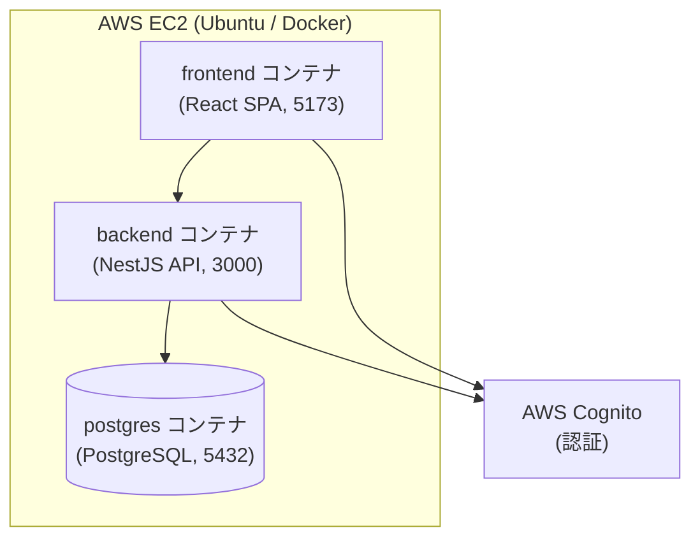

# AWS EC2 デプロイ手順（Ubuntu 版）

本ドキュメントは、AI Team Planner を AWS EC2（Ubuntu Server）上に Docker でデプロイし、動作確認するための手順です。frontend / backend / postgres の 3 コンテナを docker compose で起動します。

## 構成概要



- 認証は AWS Cognito（User Pool）に委譲します。
- postgres はコンテナ内部通信のみで、外部（セキュリティグループ）には公開しません。
- 本番では postgres を Amazon RDS へ切り替えることを推奨します（本手順では動作確認用にコンテナ利用）。

## 前提条件

- AWS アカウントと EC2 を作成できる権限
- リポジトリ: https://github.com/jaeil086/tcpProject
- AWS Cognito の User Pool・アプリクライアントが作成済みであること（未作成の場合は「付録: Cognito の作成」を参照）

## 1. EC2 インスタンスの作成

- AMI: **Ubuntu Server 24.04 LTS（64ビット x86）**
- インスタンスタイプ: **t3.small**（2 vCPU / 2 GiB 以上を推奨。3 コンテナ同居＋ビルドのため）
- キーペア: 新規作成（RSA / .pem）。ダウンロードした .pem は再取得不可のため大切に保管する
- ストレージ: **30 GiB（gp3）**
- セキュリティグループ（インバウンド）:
  - 22（SSH） … ソース: マイ IP
  - 3000（backend API 確認用） … ソース: マイ IP
  - 5173（frontend 確認用） … ソース: マイ IP
  - ※ 5432（PostgreSQL）は開放しない（コンテナ内部通信のみ）

## 2. SSH 接続

Ubuntu の SSH ユーザー名は `ubuntu` です（Amazon Linux の `ec2-user` とは異なる）。

```bash
# Windows の場合、鍵の権限が緩いと拒否されることがあるため注意
ssh -i "C:\path\to\ai-team-planner-key.pem" ubuntu@<EC2のパブリックIP>
```

## 3. Docker / Docker Compose / git のインストール（Ubuntu）

EC2 に接続後、以下を実行します（Ubuntu は apt を使用）。

```bash
# パッケージ更新と前提パッケージ
sudo apt-get update
sudo apt-get install -y ca-certificates curl git

# Docker 公式リポジトリの GPG キーとリポジトリを追加
sudo install -m 0755 -d /etc/apt/keyrings
sudo curl -fsSL https://download.docker.com/linux/ubuntu/gpg -o /etc/apt/keyrings/docker.asc
sudo chmod a+r /etc/apt/keyrings/docker.asc
echo \
  "deb [arch=$(dpkg --print-architecture) signed-by=/etc/apt/keyrings/docker.asc] https://download.docker.com/linux/ubuntu \
  $(. /etc/os-release && echo \"$VERSION_CODENAME\") stable" | \
  sudo tee /etc/apt/sources.list.d/docker.list > /dev/null

# Docker 本体と Compose プラグイン
sudo apt-get update
sudo apt-get install -y docker-ce docker-ce-cli containerd.io docker-compose-plugin

# sudo なしで docker を使えるように現在ユーザーを docker グループへ追加
sudo usermod -aG docker ubuntu

# グループ変更を反映するため、一度ログアウトして再接続する
exit
```

再接続後、インストールを確認します。

```bash
docker --version
docker compose version
```

## 4. アプリケーションの取得

```bash
git clone https://github.com/jaeil086/tcpProject.git
cd tcpProject
```

## 5. 環境変数の設定（.env）

リポジトリ直下に `.env` を作成します。docker compose がこれを読み込み、各コンテナへ環境変数を渡します。
`<...>` の値は自分の環境（Cognito の値・EC2 のパブリック IP）に置き換えてください。

```bash
cat > .env <<'EOF'
# --- PostgreSQL（コンテナ間接続。DATABASE_HOST は compose のサービス名 postgres のまま） ---
DATABASE_HOST=postgres
DATABASE_PORT=5432
DATABASE_USER=teamapp
DATABASE_PASSWORD=teamapp_password
DATABASE_NAME=teamapp

# --- AWS Cognito ---
COGNITO_REGION=ap-northeast-1
COGNITO_USER_POOL_ID=<あなたの User Pool ID>
COGNITO_CLIENT_ID=<あなたのアプリクライアント ID>

# --- フロントエンドが参照する API のベース URL ---
# ブラウザ（自分の PC）から見た backend の URL。EC2 のパブリック IP を指定する。
VITE_API_BASE_URL=http://<EC2のパブリックIP>:3000
EOF
```

補足:
- `DATABASE_HOST=postgres` は変更しないこと。backend コンテナは同じ compose ネットワーク上のサービス名 `postgres` で DB に接続する（ローカルで発生した ECONNREFUSED は、ローカルに DB が無かったため。この構成では postgres コンテナが同時に起動するため発生しない）。
- `VITE_API_BASE_URL` はブラウザから見た URL のため `localhost` ではなく EC2 のパブリック IP を用いる。CORS 許可のため backend 側の許可オリジンにも frontend の URL が必要（下記参照）。

### CORS の許可オリジン（重要）

backend は既定で `http://localhost:5173` からのアクセスのみ許可します。EC2 のパブリック IP からアクセスする場合、`.env` に次を追記して許可オリジンを上書きしてください。

```bash
echo "CORS_ORIGIN=http://<EC2のパブリックIP>:5173" >> .env
```

## 6. 起動

```bash
docker compose up -d --build   # 初回はビルドに数分かかる
docker compose ps              # frontend / backend / postgres が Up であることを確認
docker compose logs -f backend # backend のログ確認（Ctrl+C で抜ける）
```

## 7. データベースマイグレーション（初回のみ）

スキーマは `synchronize: false` のためマイグレーションで作成します。backend コンテナ内で実行します。

```bash
docker compose exec backend npm run migration:run
```

## 8. 動作確認

- frontend: ブラウザで `http://<EC2のパブリックIP>:5173` を開く
- backend: `http://<EC2のパブリックIP>:3000/api`（保護 API は 401 が返るのが正常）
- ログイン: Cognito にテストユーザーを作成しておき、そのメール／パスワードでログインする
- postgres の永続化: `docker compose down`（`-v` を付けない）後に再起動してもデータが残ること

## 9. 更新デプロイ

```bash
git pull
docker compose up -d --build
docker compose exec backend npm run migration:run   # 新しいマイグレーションがある場合
```

## 付録: AWS Cognito の作成（未作成の場合）

1. AWS コンソールで **Cognito** → 「ユーザープールを作成」
2. サインインオプション: **メールアドレス** を選択
3. パスワードポリシー・MFA は動作確認用途なら既定または「MFA なし」で可
4. アプリケーションクライアントを作成:
   - パブリッククライアント（クライアントシークレットなし）
   - **認証フロー**で `ALLOW_USER_PASSWORD_AUTH`（USER_PASSWORD_AUTH）を有効化する（backend の InitiateAuth が USER_PASSWORD_AUTH を使うため必須）
5. 作成後、次の 3 つを控えて `.env` に設定:
   - リージョン（例: `ap-northeast-1`） → `COGNITO_REGION`
   - ユーザープール ID（例: `ap-northeast-1_xxxxxxxxx`） → `COGNITO_USER_POOL_ID`
   - アプリクライアント ID → `COGNITO_CLIENT_ID`
6. テストユーザーを 1 名作成（「ユーザーを作成」）。初回パスワード変更が必要な設定の場合は、確認済み・恒久パスワードにしておくと動作確認が楽。
   - アプリユーザー（DB の user テーブル）と Cognito ユーザーは `cognito_sub` で紐付く。動作確認では DB 側にも対応するユーザー行が必要になる点に注意。

## セキュリティ上の注意

- `.env`・`.pem` はリポジトリにコミットしないこと（`.gitignore` で除外済み）。
- 動作確認が終わったら不要な EC2 は停止／削除してコストと露出を抑える。
- 本番運用ではシークレットを AWS Systems Manager Parameter Store / Secrets Manager で管理し、HTTPS 化（リバースプロキシ + ACM/Let's Encrypt）を行うこと。

## TODO（今後の整備項目）

- リバースプロキシ（Nginx など）による 80/443 の受け口と TLS 終端
- postgres の RDS 移行・バックアップ方針
- CI/CD パイプラインからの自動デプロイ
- ログ・メトリクス監視（CloudWatch など）
