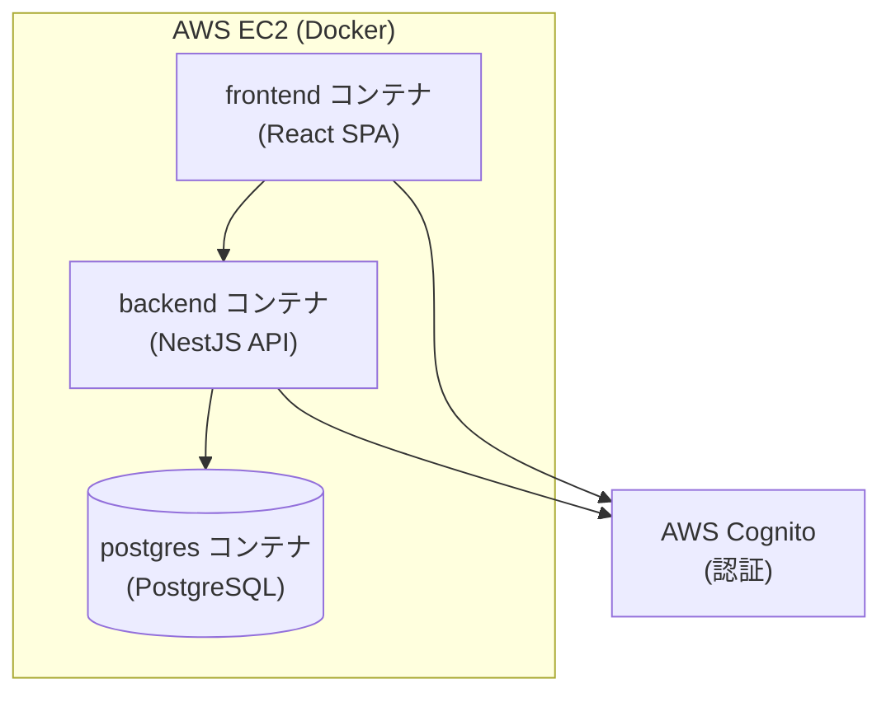

# AWS EC2 デプロイ手順（雛形）

本ドキュメントは、AI Team Planner を AWS EC2 上に Docker でデプロイするための手順の雛形です。具体的なコマンドや構成は、後続タスクの実装進捗に合わせて更新してください。

## 構成概要



- frontend / backend / postgres の 3 コンテナを `docker-compose.yml` で起動します。
- 認証は AWS Cognito（User Pool）に委譲します。
- 本番では postgres を Amazon RDS などのマネージドサービスに切り替えることを推奨します（雛形段階ではコンテナ利用を想定）。

## 前提条件

- AWS アカウントと、EC2 インスタンスを作成できる IAM 権限
- デプロイ対象の EC2 インスタンス（Amazon Linux 2023 などを想定）
- SSH でインスタンスに接続できる鍵ペア
- AWS Cognito の User Pool およびアプリクライアントが作成済みであること

## 1. EC2 インスタンスの準備

1. EC2 インスタンスを作成する（インスタンスタイプ・ストレージは負荷に応じて選定）。
2. セキュリティグループで以下のポートを許可する。
   - 22（SSH、接続元 IP を限定することを推奨）
   - 80 / 443（フロントエンドへの HTTP / HTTPS アクセス）
3. Elastic IP を割り当てる（任意、固定 IP が必要な場合）。

## 2. Docker のインストール

EC2 インスタンスに SSH 接続し、Docker と Docker Compose をインストールします。

```bash
# 例: Amazon Linux 2023
sudo dnf update -y
sudo dnf install -y docker
sudo systemctl enable --now docker
sudo usermod -aG docker ec2-user   # 再ログインで反映

# Docker Compose プラグイン
sudo dnf install -y docker-compose-plugin
docker compose version
```

## 3. アプリケーションの配置

```bash
# リポジトリを取得（または CI/CD でアーティファクトを配置）
git clone <REPOSITORY_URL> teamApp
cd teamApp
```

## 4. 環境変数の設定

本番用の環境変数を設定します。`.env` ファイルまたはデプロイ環境の環境変数で、開発用の既定値を上書きしてください。

| 変数 | 説明 |
| --- | --- |
| `DATABASE_HOST` / `DATABASE_PORT` | DB 接続先（RDS 利用時はそのエンドポイント） |
| `DATABASE_USER` / `DATABASE_PASSWORD` / `DATABASE_NAME` | DB 認証情報 |
| `COGNITO_REGION` | Cognito のリージョン |
| `COGNITO_USER_POOL_ID` | Cognito User Pool ID |
| `COGNITO_CLIENT_ID` | Cognito アプリクライアント ID |
| `VITE_API_BASE_URL` | フロントエンドが参照する API のベース URL |

> **注意**: 認証情報やシークレットはリポジトリにコミットせず、AWS Systems Manager Parameter Store や Secrets Manager などで管理することを推奨します。

## 5. 起動

```bash
docker compose up -d --build
docker compose ps      # 各サービスの状態確認
docker compose logs -f # ログ確認
```

## 6. 動作確認

- frontend にブラウザからアクセスできること
- backend の API がフロントエンドから疎通できること
- postgres にデータが永続化されること（`docker compose down` 後も保持されること）

## 7. 更新デプロイ

```bash
git pull
docker compose up -d --build
```

## TODO（今後の整備項目）

- リバースプロキシ（Nginx など）による 80/443 の受け口と TLS 終端
- HTTPS 証明書の取得・更新（AWS Certificate Manager / Let's Encrypt など）
- postgres の RDS 移行、バックアップ方針
- CI/CD パイプラインからの自動デプロイ
- ログ・メトリクス監視（CloudWatch など）
